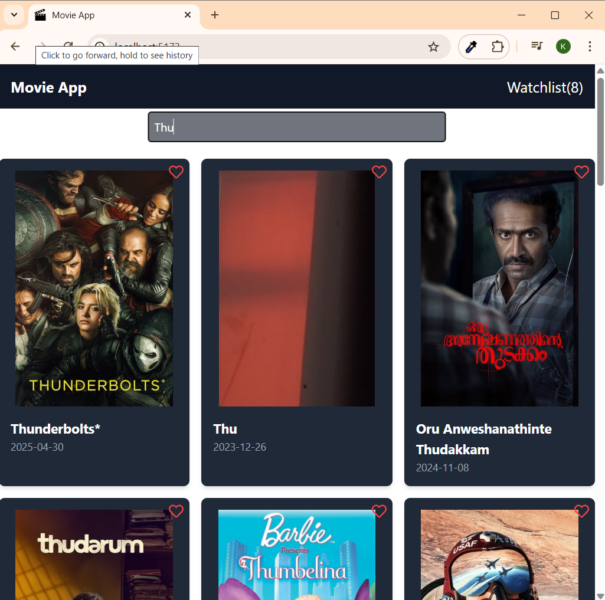
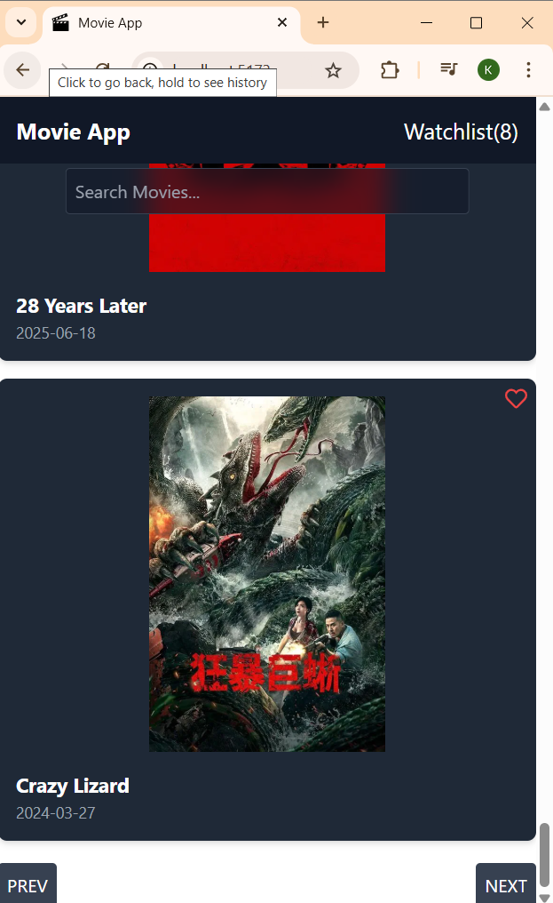
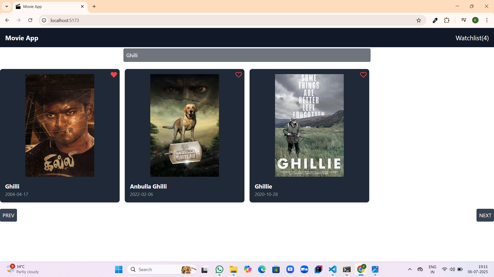

# 🎬 Movie App

This is a fully responsive and clean **Movie App** built using **React**, **Tailwind CSS**, and **Vite**. The project fetches data from the **TMDB API**, allowing users to explore popular movies, search for titles, paginate through movie pages, and manage favorites in a modern, minimal UI.

## Features

- **Popular Movies Listing**  
  Fetch and display trending and popular movies using the TMDB API.

- **Search Functionality**  
  Users can search for specific movie titles and get instant results.

- **Pagination**  
  Navigate seamlessly through multiple pages of movies.

- **Movie Cards**  
  Display poster, title, release date, and an add-to-favorites option.

- **Favorites Management**  
  Users can add and remove movies from their favorites list.

- **Responsive Design**  
  Fully adaptive layout for desktops, tablets, and mobile devices.

- **Smooth UI**  
  Clean design with Tailwind CSS, hover effects, and organized card layouts.

## Technologies Used

- React.js  
- Tailwind CSS  
- Vite  
- TMDB API  
- Responsive Web Design

## Folder Structure

Movie-App/
│
├── public/
│   └── vite.svg
│
├── src/
│   ├── Screenshots/          # Project screenshots
│   │   ├── Homepage.png
│   │   ├── Homepage_md_Searchfunc.png
│   │   ├── Homepage_sm_Pagination.png
│   │   ├── Watchlist.png
│   │   ├── Watchlistsearchfunc.png
│   │   └── GenreFilter.png
│   │
│   ├── components/           # Reusable React components
│   │   ├── Navbar.jsx
│   │   ├── MovieCard.jsx
│   │   ├── SearchBar.jsx
│   │   ├── Pagination.jsx
│   │   └── Favorites.jsx
│   │
│   ├── pages/                # Page components (Home, Favorites)
│   │   ├── Home.jsx
│   │   └── FavoritesPage.jsx
│   │
│   ├── App.jsx               # Main application file
│   ├── main.jsx              # React DOM render file
│   ├── App.css               # Global styles
│   └── index.css             # Tailwind imports
│
├── .gitignore
├── index.html
├── package.json
├── postcss.config.js
├── tailwind.config.js
├── vite.config.js
└── README.md

## Screenshots

### 1️⃣ Home Page (Desktop)

### 2️⃣ Home Page (Tablet Search View)

### 3️⃣ Home Page (Mobile Pagination View)

### 4️⃣ Watchlist

### 5️⃣ Watchlist Search Functionality

### 6️⃣ Genre Filter

## Author

Developed by [Karthiga P](https://github.com/KarthigaP20)

## Live Demo

Visit the live site: [Movie App](https://movie-app-sigma-ten-14.vercel.app/)

## Feedback

Thank you for checking out this project.  
Feel free to open issues or give suggestions for improvement.

Made with ❤️ using React, Tailwind CSS, Vite, and TMDB API.
